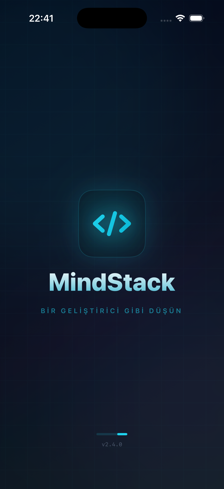

# MindStack (SwiftUI)

MindStack is a native iOS learning app built with SwiftUI to help users think like developers through structured daily challenges, task flows, and progress-driven learning.

This project is implemented based on `SWIFT_IMPLEMENTATION_GUIDE.md` and the UI references in `stitch_mindstack`.

## Run Locally

1. Open `mindstack_swift/MindStack.xcodeproj` in Xcode
2. Select an iOS Simulator (iOS 16+)
3. Press Run

## Supabase Integration

Supabase support is optional and conditionally compiled via `#if canImport(Supabase)`.

- If the package is not installed, the app runs with **mock data**.
- To install Supabase: Xcode → File → Add Package Dependencies → `https://github.com/supabase/supabase-swift` (2.x)

Set these keys in `Info.plist`:

- `SUPABASE_URL`
- `SUPABASE_ANON_KEY`

